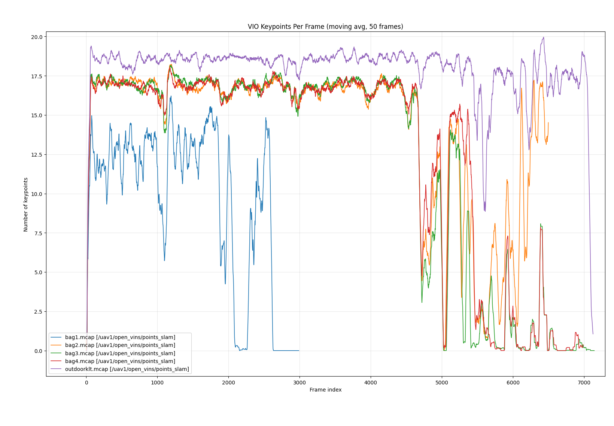
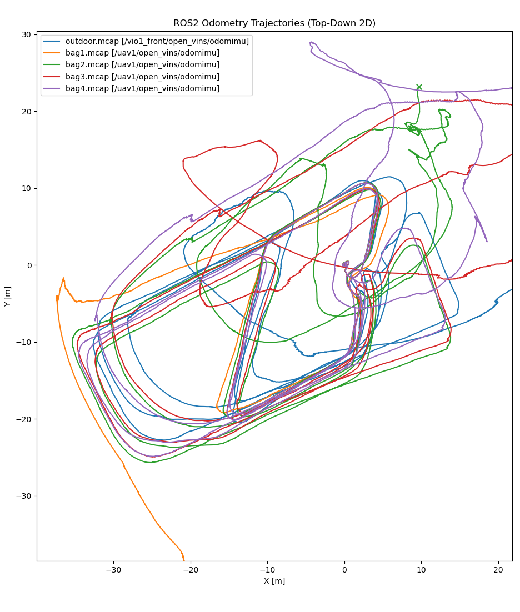

# mrs_openvins_superpoint
The base OpenVins fork is from the MRS group at CTU Prague. [mrs openvins core](https://github.com/ctu-mrs/mrs_open_vins_core) for launch files and dependecies.  

# SuperPoint OpenVins
Implementation of the SuperPoint neural network in OpenVins for feature and descriptor extraction. Currently, only the PyTorch branch is working properly. Other branches use libtorch (C++ libtorch api), and using my converted weights doesn't return correct descriptors.

The whole repo is a bit messy as I tried several options for my research.
You can try SuperPoint implementation and tracking in pytorch branch. I am getting better matching results than with ORB descriptor. However, compared to KLT, it is slow and bad.

